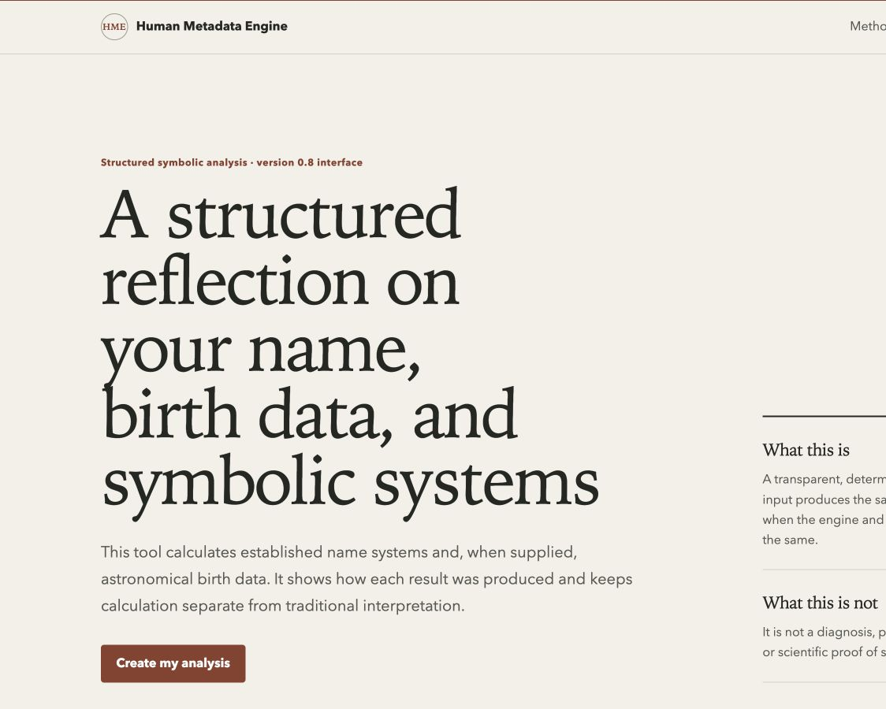
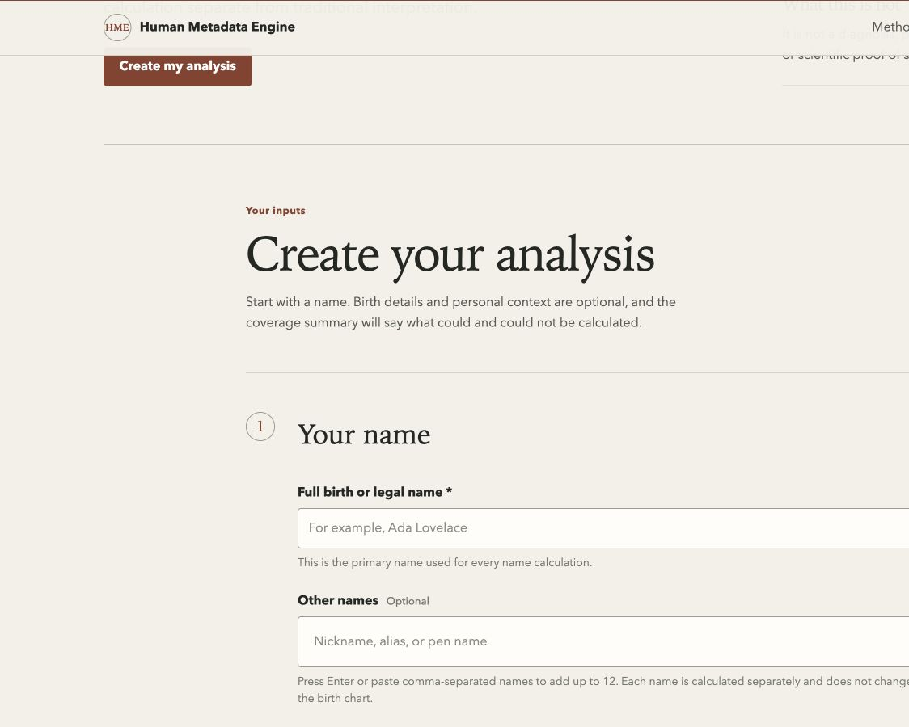
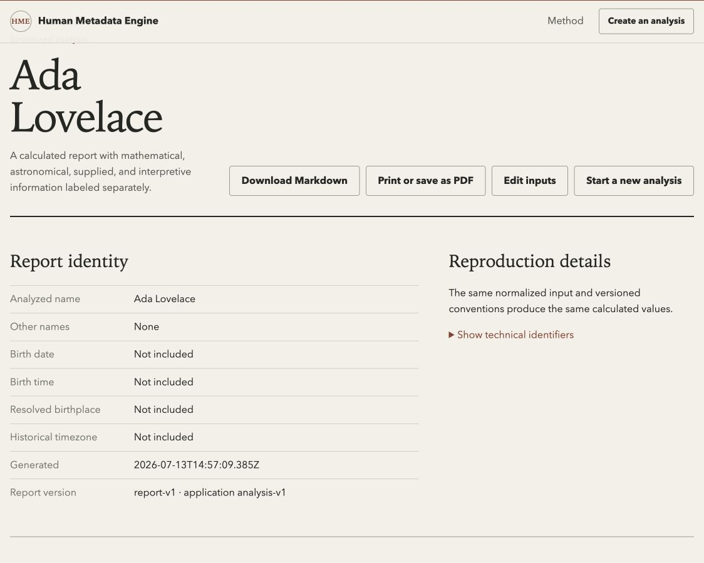
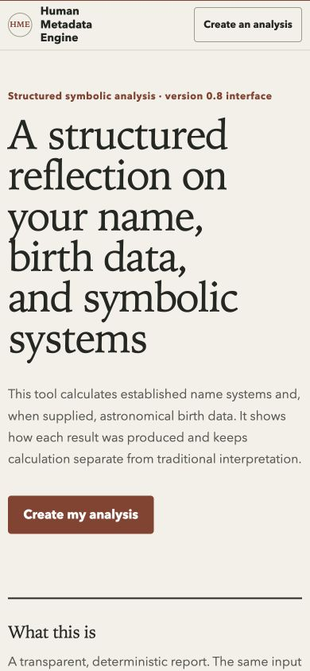
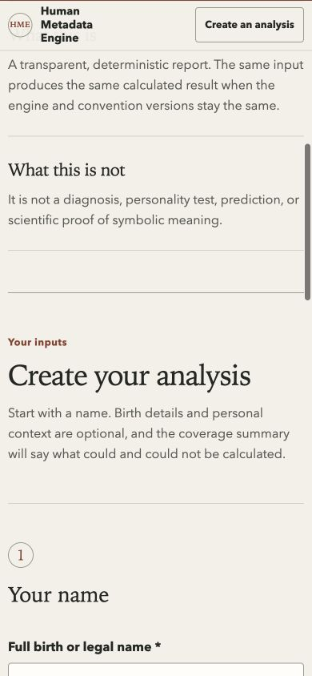
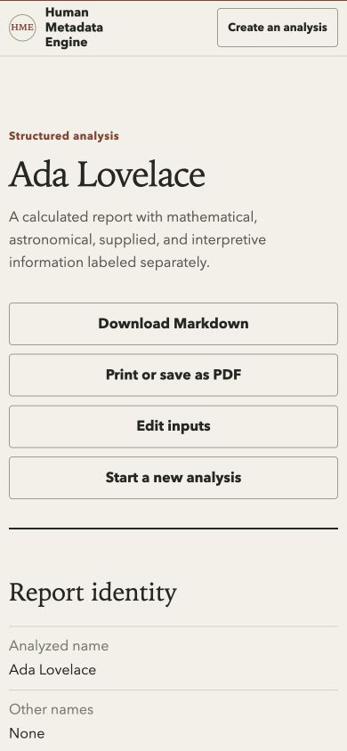

# v0.8 Interface Architecture

The v0.8.0 application and interface are a presentation-layer release over the
unchanged `analysis-v1` API, `signature-v2` engine, and `report-v1` report
contracts. It does not move calculations into JavaScript or change stable error
codes.

## Design principles

- Explain the product within the first view: a structured reflection using
  calculations, astronomy, and symbolic traditions.
- Carry hierarchy with typography and spacing rather than a dashboard of cards.
- Translate technical terms at first use while retaining machine-readable API
  values unchanged.
- Treat missing information as missing. Unknown birth time withholds
  time-sensitive fields and never appears as an observed noon.
- Admit disagreement between systems instead of forcing a coherent personality
  story.
- Use one restrained accent color, system fonts, no external assets, no trackers,
  and no frontend framework.

## Information architecture

The public page has five surfaces:

1. Introduction and product boundary.
2. Three-step input workflow: name, birth details, optional personal context.
3. Human-readable review and honest indeterminate loading state.
4. Report identity, coverage, overview, eight report destinations, and actions.
5. Permanent methods and limitations section.

The report navigation is a wrapped link list on wide screens and a disclosure
menu on small screens. The reading column is limited to roughly 70 characters.

## Accessibility behavior

- One visible page `h1` before results and sequential section headings.
- Persistent labels and linked hints for every input.
- Alias tokens support Enter, comma-separated paste, Backspace removal, named
  remove buttons, duplicate rejection, and live announcements.
- Multiple validation failures remain visible together, set `aria-invalid`,
  receive inline descriptions, and focus the first affected field.
- Ambiguous locations focus a titled radiogroup; each choice is keyboard
  operable and preserves the rest of the form.
- Loading uses a polite live region, disables duplicate submission, and does not
  invent percentages or server stages.
- Successful generation focuses the report title.
- Reduced-motion and print styles are included.

## Information-type translation

| API category | Public label |
| --- | --- |
| `mathematical` | Mathematical calculation |
| `astronomical` | Astronomical calculation |
| `user_reported` | Supplied by you |
| `traditional_symbolic` | Traditional interpretation |
| `heuristic` | Rule-based estimate |
| `speculative_synthesis` | Interpretive synthesis |

The former composite or resonance language is presented publicly as the
“cross-system convergence score,” followed immediately by its project-specific,
non-scientific limit.

## Birth time and location

“I do not know my exact birth time” hides and disables the time field. The
request retains the existing backend compatibility value with
`time_accuracy: unknown`; the UI and report show “Unknown,” withhold the rising
sign, houses, and Human Design, and never display the compatibility value.

An ambiguous provider result is shown as “Which place did you mean?” Each choice
shows city, region, country, and timezone; coordinates remain in technical
details. Choosing a result populates the existing advanced fields and continues
the same request without clearing other entries.

## Privacy wording

The form states that entries create the report and that the normal application
logs do not intentionally include the name, exact birth time, or coordinates.
It also states that birthplace text may be sent to the configured provider.
Methods identify Open-Meteo and preserve the existing warning that browser,
network, reverse-proxy, or infrastructure logs may still exist.

## Screenshots and QA boundary

Sanitized desktop and mobile screenshots are stored in `docs/assets/ui-v08/`.
They use a name-only fixture and contain no birth time, coordinates, or personal
context. Detailed local audit captures for the requested Kirk flow remain
untracked under `/tmp/human-metadata-engine-ui-audit/`.

### Desktop

### Mobile

Browser viewport checks cover 320×568, 360×800, 390×844, 412×915, 768×1024,
1024×768, 1280×800, and 1440×900. Physical-device testing in Safari and Android
Chrome is still outstanding. No observed-user comprehension claim is made.
